# 🛡️ PWN — Policy Work Norms (`pwn`)

> **Contract-Governed Agent Harness CLI** — Governança determinística de agentes de IA por contratos normativos em JSON, validação mecânica de portões (*gates*), execução isolada em Git Worktree sandboxes e contenção de escopo via Diff Guard.

[](https://bun.sh)
[](https://www.typescriptlang.org/)
[](https://json-schema.org/)
[](tests/)
[](LICENSE)

---

## 📌 Por que o PWN existe?

Agentes de codificação autônomos baseados unicamente em *prompts* sofrem de quatro falhas estruturais conhecidas:
1. **Desvio de Escopo (*Scope Drift*):** O agente decide refatorar arquivos não relacionados, deletar testes ou alterar a arquitetura sem autorização.
2. **Alucinação de Requisitos:** Invenção de premissas não aprovadas durante a transição entre ideia, requisitos e código.
3. **Custo Desproporcional:** Modelos de fronteira caros executando tarefas triviais, ou modelos baratos operando sem rédeas em tarefas críticas.
4. **Falso Sucesso:** Agentes reportam conclusão sem evidência mecânica auditável (ex.: testes não foram executados ou foram alterados para passar).

O **PWN** substitui a confiança cega em prompts por **mecanismos determinísticos de engenharia**:

| Abordagem Tradicional (Prompt-Only) | Abordagem PWN (Contract-Governed) |
|---|---|
| Prompts longos e instruções informais em Markdown | **Documentos normativos JSON** validados contra JSON Schemas formais |
| Agente altera qualquer arquivo do repositório | **Diff Guard mecânico**: escrita bloqueada fora de `write_allow` |
| Execução direta no branch de trabalho | **Sandboxes descartáveis em Git Worktree** (`.pwn/sandboxes/`) |
| Transições de fase avaliadas pelo próprio LLM | **5 Gates determinísticos em TypeScript** com cache por hash e veredito HMAC |
| Modelo único ou seleção manual | **Roteamento por 5 níveis de risco (L0–L4)** com escalação automática |
| Conclusão baseada em texto ("Tarefa finalizada!") | **Auditoria TDD estrita** com atestação versionada e exit codes por classe |

---

## 🔄 Fluxo de Trabalho e Modelo Mental

Toda alteração de software no PWN segue uma cadeia estrita de rastreabilidade (proveniência) do problema à evidência verificada:

```mermaid
flowchart LR
    A[Discovery\nProblema & Atores] -->|GATE-DISC-REQ| B[Requirements\nRequisitos Funcionais]
    B -->|GATE-REQ-PRD| C[PRD\nDecisões Aceitas]
    C -->|GATE-PRD-SPEC| D[Spec\nCapabilities & Regras]
    D -->|GATE-SPEC-PLAN| E[Plan\nTarefas Atômicas]
    E -->|GATE-PLAN-CONTRACT| F[Contrato V4\n7 Dimensões Congeladas]
    F --> G[Sandbox Worktree\n+ Diff Guard]
    G --> H[Auditoria TDD\nRED ➔ GREEN ➔ Atestação]
```



1. **Cadeia de Planejamento:** Cada transição de fase exige a aprovação de um portão determinístico (*gate*). Se faltar vínculo de rastreabilidade, o portão bloqueia a execução.
2. **Contrato V4 Congelado:** Antes de executar qualquer código, a tarefa recebe um contrato atômico imutável (`CTR-*.json`) definindo `write_allow`, `write_deny`, invariantes e critérios de aceite.
3. **Execução Confinada:** O agente executa dentro de uma Git Worktree isolada. O Diff Guard confere as modificações via `git diff`; se o agente tocar em arquivos proibidos, a execução é abortada e escalada para um modelo superior.
4. **Auditoria TDD:** O ciclo RED → GREEN é verificado deterministicamente via CLI com códigos de saída semânticos.

---

## 🚀 Instalação e Uso Rápido

### Pré-requisitos
- [Bun](https://bun.sh) v1.4.0 ou superior (o PWN é Bun-first; Node.js não é necessário)
- [Git](https://git-scm.com/)

### Instalação

```bash
# 1. Clonar o repositório
git clone https://github.com/passoz/pwn.git
cd pwn

# 2. Instalar dependências (rápido, apenas Ajv + types)
bun install

# 3. Validar a integridade dos documentos normativos do framework
bun bin/pwn.js self-check

# 4. Rodar a suíte completa de testes (304 testes)
bun test
```

*(Opcional)* Crie um alias local no seu shell para facilitar:
```bash
alias pwn="bun $(pwd)/bin/pwn.js"
```

---

## 👤 Guia do Usuário: Governando um Projeto com PWN

### 1. Criando um novo Work governado (Greenfield)

Para criar uma funcionalidade do zero com a cadeia completa e válida de ponta a ponta:

```bash
# Cria o esqueleto completo: discovery → requirements → prd → spec → plan + contratos V4
./scripts/prepare-greenfield-work.sh "Sistema de Autenticação JWT"

# Ou diretamente pelo CLI:
bun bin/pwn.js work scaffold --title "Sistema de Autenticação JWT" --risk L2
```

O comando gera os artefatos sob `.pwn/work/<work-id>/` (ex.: `.pwn/work/0002/`).

### 2. Validando a cadeia de portões (Gates)

Verifique se a cadeia documental está íntegra antes de encostar no código:

```bash
# Roda todos os 5 gates e exibe todos os achados em uma passada só:
bun bin/pwn.js work gate --all --work 0002

# Ou avalie um portão específico (com cache determinístico por hash):
bun bin/pwn.js work gate GATE-DISC-REQ --work 0002
bun bin/pwn.js work gate GATE-PLAN-CONTRACT --work 0002
```

### 3. Pré-voo de Execução (`--dry-run`)

Antes de gastar tokens ou criar sandboxes, faça o pré-voo para listar **todos** os impedimentos:

```bash
bun bin/pwn.js work run --dry-run --work 0002 -- bun test
```

Se houver gates pendentes ou contratos inválidos, o PWN lista todos os problemas e encerra sem executar comandos.

### 4. Executando com Sandbox e Diff Guard

Execute a tarefa com confinamento estrito:

```bash
# Exige gates aprovados, cria worktree temporária em .pwn/sandboxes/ e confere diff:
bun bin/pwn.js work run --work 0002 --timeout-seconds 600 -- bun test
```

- **Fail-closed:** Sem `--no-gate`, recusa qualquer Work com portão pendente.
- **Diff Guard:** Se o agente modificar algo fora de `write_allow` ou dentro de `write_deny`, a execução é abortada.
- **Escape consciente:** `--no-gate` pula os portões mantendo a guarda de escrita; `--no-isolation` pula a sandbox mas registra o escape em `.pwn/metrics.jsonl`.

### 5. Auditoria TDD Estrita

Para fluxos de alto rigor (L2–L4):

```bash
# 1. Registra a fase RED com asserção congelada nos testes:
bun bin/pwn.js work audit red --work 0002 --task 1.1 --expect "should throw UnauthorizedError" --expect-literal -- bun test

# 2. Registra a fase GREEN após implementar:
bun bin/pwn.js work audit green --work 0002 --task 1.1 -- bun test

# 3. Emite a atestação criptográfica de aceitação:
bun bin/pwn.js work audit candidate --work 0002 --task 1.1 -- bun test
```

### 6. Fila Assíncrona AFK (*Away From Keyboard*)

Tarefas de risco **L4** ou que falharam em múltiplas tentativas são suspensas para revisão humana em `queue/review/`:

```bash
# Listar tarefas suspensas aguardando aprovação
bun bin/pwn.js queue list

# Inspecionar e aprovar para execução
bun bin/pwn.js queue approve <run-id>

# Rejeitar execução de alto risco
bun bin/pwn.js queue reject <run-id>
```

---

## 🛠️ Guia do Desenvolvedor: Contribuindo com o PWN

Se você deseja desenvolver ou estender o PWN, a arquitetura foi desenhada para ser simples, sem magia e com checagens rigorosas.

### Estrutura do Código-Fonte

```
pwn/
├── bin/pwn.js                 # Ponto de entrada executável (Node-guard + Bun boot)
├── src/
│   ├── cli.ts                 # Despacho de subcomandos e tratamento de flags
│   ├── commands/              # Handlers de comandos CLI
│   │   ├── work.ts            # Gestão da cadeia de Works, gates, scaffold e audit
│   │   ├── task.ts            # Execução de tarefas isoladas e cápsula de contexto
│   │   ├── queue.ts           # Fila de aprovação humana AFK
│   │   ├── target.ts          # Materialização de alvos (Pi, OpenCode, omp)
│   │   ├── metrics.ts         # Métricas e otimização consultiva de custos
│   │   └── validate.ts        # Validação de schemas e mutation testing
│   ├── core/                  # Motores determinísticos do harness
│   │   ├── gates.ts           # Implementação dos 5 portões determinísticos
│   │   ├── gate-cache.ts      # Cache de vereditos com assinatura HMAC
│   │   ├── contract-engine.ts # Contratos de 7 dimensões e cálculo de risco
│   │   ├── contract-guard.ts  # Diff Guard mecânico (write_allow / write_deny)
│   │   ├── router.ts          # Roteamento econômico de modelos por risco (L0-L4)
│   │   ├── sandbox.ts         # Isolamento via Git Worktree
│   │   ├── validator.ts       # Validador Ajv com leis embutidas (drift detector)
│   │   ├── self_check_mutate.ts # Mutation testing dos próprios portões
│   │   └── tool-api.ts        # Execução confinada com bloqueio de path traversal
│   └── targets/               # Adapters de materialização (pi, opencode, omp)
├── schemas/                   # JSON Schemas formais (Draft-07)
├── tests/                     # 30 suítes de testes unitários e adversariais
└── tools/
    └── pipeline-editor/       # Editor visual standalone (HTML/CSS/JS sem servidor)
```

### Leis Embutidas e Proteção contra *Drift*

Os JSON Schemas em `schemas/` são embutidos diretamente no código TypeScript via import estático. Se os schemas em disco divergirem da cópia embutida, o CLI aborta imediatamente com erro de integridade. Isso impede que alterações acidentais em schemas afrouxem a governança em tempo de execução.

### Comandos de Verificação do Framework

```bash
# Valida conformidade de schemas do framework
bun bin/pwn.js self-check

# Mutation testing dos gates (revela se algum gate é decorativo)
bun bin/pwn.js self-check --mutate

# Validação completa de CI (Typecheck + Testes + Self-check + Validações de Work)
bun run check
```

---

## 📋 Referência Rápida de Comandos do CLI

### 🩺 Integridade & Validação
| Comando | Descrição |
|---|---|
| `pwn self-check` | Valida todos os documentos normativos do framework contra seus schemas |
| `pwn self-check --mutate` | Roda mutation testing quebrando artefatos para verificar se os gates bloqueiam |
| `pwn validate [--work NNNN]` | Valida os documentos JSON do(s) Work(s) com Ajv |

### 📋 Governança de Works e Gates
| Comando | Descrição |
|---|---|
| `pwn work init` | Auto-atribui e cria o próximo Work ID sequencial com templates iniciais |
| `pwn work scaffold --title "..."` | Cria Work completo com cadeia válida (discovery → requirements → prd → spec → plan + CTR) |
| `pwn work gate --all [--work NNNN]` | Avalia os 5 gates em uma passada única e agrupa todos os achados |
| `pwn work gate <GATE> [--work NNNN]` | Avalia um portão específico (`GATE-DISC-REQ`, `GATE-REQ-PRD`, etc.) usando cache |
| `pwn work gate --clear-cache` | Limpa o cache de vereditos (`.pwn/gate-cache/`) |
| `pwn work status --coverage` | Exibe matriz de rastreabilidade (requisitos → caps → tasks → contratos → ACs) |
| `pwn work plan [--work NNNN]` | Renderiza ou valida o `plan.md` a partir do `plan.json` normativo |

### 🛡️ Execução, Sandboxes & Auditoria TDD
| Comando | Descrição |
|---|---|
| `pwn work run --dry-run -- <cmd>` | Pré-voo: lista todos os impedimentos (gates/contratos) sem executar comandos |
| `pwn work run -- <cmd>` | Execução completa em sandbox Worktree com Diff Guard e checagem de gates |
| `pwn work run --no-gate -- <cmd>` | Pula verificação de portões mantendo enforcement de sandbox e escrita |
| `pwn work audit --task <T> -- <cmd>` | Verifica integridade das evidências TDD da tarefa |
| `pwn work audit red --task <T> --expect "..." -- <cmd>` | Registra evidência de teste falhando (fase RED) |
| `pwn work audit green --task <T> -- <cmd>` | Registra evidência de teste passando com mesmo comando (fase GREEN) |
| `pwn work audit candidate --task <T> -- <cmd>` | Gera atestação de aceitação imutável com hash das evidências |

### ⏸️ Fila Humana AFK & Cápsula
| Comando | Descrição |
|---|---|
| `pwn task capsule <task> <work>` | Exibe o contrato congelado V4 e a cápsula de contexto para o agente |
| `pwn queue list` | Lista tarefas suspensas aguardando revisão humana |
| `pwn queue approve <run-id>` | Aprova execução de tarefa retida na fila |
| `pwn queue reject <run-id>` | Rejeita execução de tarefa retida |

### 🎯 Targets, Métricas & Ferramentas Visuais
| Comando | Descrição |
|---|---|
| `pwn target list` | Exibe matriz de capacidades dos targets (`pi`, `opencode`, `omp`, `raw`) |
| `pwn target materialize --target opencode` | Materializa configs nativas (`AGENTS.md`, `opencode.jsonc`) sem perda silenciosa |
| `pwn metrics list` | Lista histórico de execuções com duração, custo e status de isolamento |
| `pwn metrics optimize` | Analisa telemetria e sugere papéis de modelo mais econômicos |

---

## 🚦 Códigos de Saída Semânticos (Automação AFK)

Para que pipelines de CI/CD e orquestradores não supervisionados operem sem ambiguidades, o PWN utiliza códigos de saída estritos por classe:

### Em `work run` e `task run`:
- `0`: **Sucesso** — Execução concluída dentro do orçamento e sem violações.
- `1`: **Violação / Bloqueio** — Portão bloqueado, violação do Diff Guard, estouro de orçamento ou comando falhou.
- `3`: **Suspenso para Revisão Humana** — Tarefa de risco L4 ou com limite de tentativas esgotado colocada na fila `queue/review/`. Permite que loops AFK saibam que a tarefa **não** executou e **não** é uma falha irrecuperável.

### Em `work audit`:
- `0`: **Sucesso** — Ciclo TDD comprovado e atestado.
- `1`: **Violação** — Tentativa inválida de procedimento (ex.: implementação alterada antes do RED, teste modificado após o GREEN).
- `2`: **Incompleto** — Evidência ou pré-requisito ausente. O relatório lista exatamente o que falta fazer antes de tentar atestar.
- `3`: **Suspenso** — Tarefa aguardando aprovação na fila.

---

## ⚙️ Política Declarativa Opcional (`.pwn/policy.json`)

Você pode customizar thresholds, palavras-chave de risco e allowlists de shell sem alterar o código-fonte criando um arquivo `.pwn/policy.json`:

```json
{
  "risk_keywords": {
    "l3": ["auth", "payment", "webhook", "crypto", "token"],
    "l1": ["readme", "changelog", "docs"]
  },
  "gate_thresholds": {
    "max_findings_before_block": 0,
    "max_acs_per_task": 12
  },
  "shell": {
    "allowed_commands": [{ "command": "bun", "args": ["test"] }],
    "denied_commands": [],
    "allow_all_shell": false
  },
  "network": {
    "allowed_domains": [],
    "denied_domains": [],
    "allow_all_network": false
  }
}
```

O arquivo é validado por `schemas/policy.schema.json`. Se ausente, o PWN utiliza seus valores padrão seguros automaticamente.

---

## 🎨 Editor Visual de Pipelines (`pwn-gui`)

O PWN inclui um editor gráfico de pipelines web standalone em HTML/CSS/JavaScript puro que opera **100% offline via `file://`**, sem necessidade de backend ou dependências npm:

- **Localização:** `tools/pipeline-editor/index.html`
- **Recursos:** Renderização em tempo real de grafos de estágios, badges de gates, painel dual de código JSON, formulário visual para configuração de modelos e exportação de templates `.env.example`.

Abrir no navegador:
```bash
# Linux
xdg-open tools/pipeline-editor/index.html

# macOS
open tools/pipeline-editor/index.html
```

---

## 📚 Índice da Documentação

Aprofunde-se na arquitetura e nos detalhes de implementação através da documentação técnica:

- 📖 **[Manual Completo da Ferramenta (`docs/MANUAL.md`)](docs/MANUAL.md)** — Guia aprofundado cobrindo o Contract Engine v4, as 7 dimensões, roteamento, sandboxes e tutorial passo a passo.
- ⚠️ **[Limites Conhecidos (`docs/LIMITES.md`)](docs/LIMITES.md)** — Relatório de transparência técnica sobre o que o harness **não** garante, com evidências em código e alternativas recomendadas.
- 🛡️ **[Plano de Testes Adversariais (`docs/SECURITY-TEST-PLAN.md`)](docs/SECURITY-TEST-PLAN.md)** — Matriz adversarial de testes de segurança, validação de sandbox e contenção de Tool API.
- 🔍 **[Revisão da Fase 1 de Enforcement (`docs/REVIEW-FASE-1-ENFORCEMENT.md`)](docs/REVIEW-FASE-1-ENFORCEMENT.md)** — Auditoria técnica de arquitetura sobre os mecanismos de contenção e resiliência.
- 🧭 **[Plano de Ajustes (`docs/PLANO-AJUSTES.md`)](docs/PLANO-AJUSTES.md)** — Diagnóstico histórico de conformidade e critérios de aceite.
- 🗄️ **[Arquivo Histórico (`docs/archive/`)](docs/archive/)** — Registro de decisões arquiteturais originais (`DECISIONS.md`) e especificação inicial (`SPEC.md`).

---

## ⚖️ Licença

Distribuído sob a licença **MIT**. Consulte o arquivo [LICENSE](LICENSE) para obter mais detalhes.
