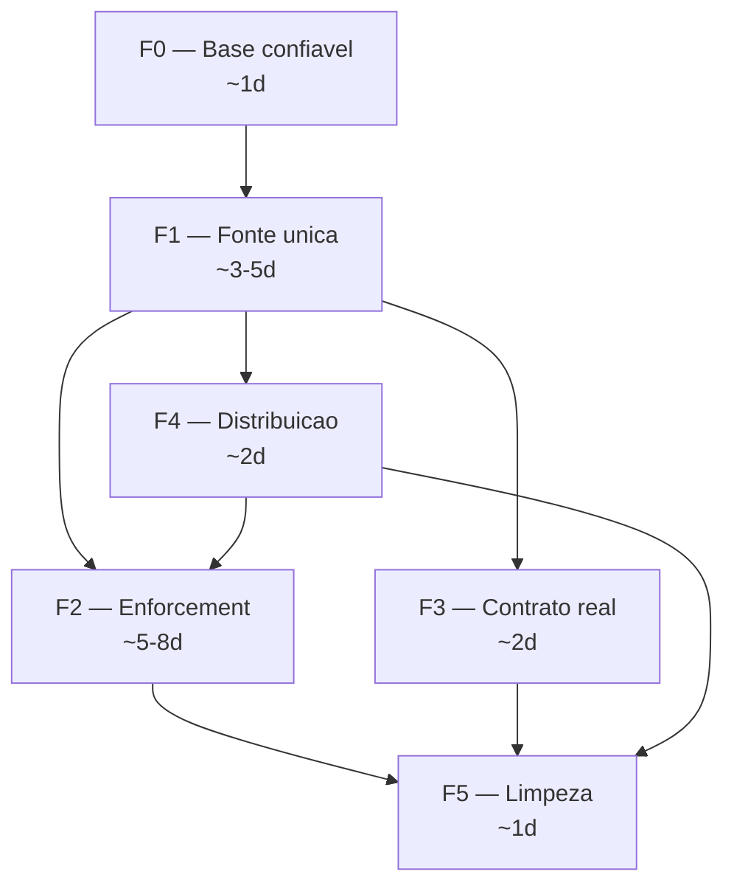

# Plano de Ajuste — Piwerness (pwn)

**Data:** 2026-09-10
**Versão avaliada:** 0.1.0 (`/home/passoz/dev/piwerness`)
**Origem do diagnóstico:** teste ponta-a-ponta em projeto real (`pwn-ledger`, em `/home/passoz/dev/teste-piwerness`)
**Evidências:** `teste-piwerness/BENCHMARK.md`, `teste-piwerness/bench/phase-timings.tsv`, `teste-piwerness/.todo/evidence/0001/`, `teste-piwerness/.todo/attestations/0001/`

---

## 1. Resumo executivo

O framework foi exercitado de ponta a ponta (concepção → gates → contratos → auditoria TDD → entrega)
sobre um app real, com 9 testes verdes e 3 tasks auditadas com evidência hash-encadeada.

| Camada | Estado |
|---|---|
| **Governança** (schemas, 5 gates, rastreabilidade, TDD audit, atestação) | **Funcional e sólida.** ~20 ms por gate; fail-closed comprovado |
| **Enforcement em runtime** (sandbox, diff guard, policy, budget, tool API) | **Implementado, não integrado.** ~1.587 linhas sem chamador em produção |
| **Produto/operacional** (distribuição, validação, scripts, docs) | **Imaturo.** Duas trilhas de artefatos, entrypoints quebrados, stubs que reportam sucesso |

**Conclusão:** hoje o Piwerness entrega o *pipeline documental auditável*. A promessa de
*pipeline executável com isolamento e diff guard* ainda não está ligada ao caminho de execução.

Progresso medido: **44 invocações `pwn` em 6.675 ms**. Custo de auditoria TDD ≈ 2,2 s por Work de 3 tasks.
O gargalo do framework não é performance — é integração.

---

## 2. Diagnóstico consolidado

### 2.1 Achados e fases que os resolvem

| ID | Achado | Severidade | Fase |
|---|---|---|---|
| A1 | Scripts npm e entrypoint não-bun quebrados (`node` + imports `.js`→`.ts`) | Alta | F0 |
| A2 | 5 falhas na suíte própria, todas por resolução de path relativa ao cwd | Alta | F0 |
| A3 | Projeto-alvo precisa de `packs/` no cwd; symlink envenena `bun test` | Alta | F4 |
| A4 | Sandbox / Diff Guard / Policy / Budget / ToolAPI inertes no runtime | **Crítica** | F2 |
| A5 | Cápsula de contexto ignora o contrato congelado (emite default L1) | **Crítica** | F3 |
| A6 | Duas trilhas de artefatos (V4 JSON vs. pack v3 markdown) não sincronizadas | Alta | F1 |
| A7 | `pwn validate` é repo-relativo e não valida os documentos do Work | Média | F1/F4 |
| A8 | Fila AFK funciona, mas nada enfileira (L4 nunca suspende) | Alta | F2 |
| A9 | Métricas nunca são escritas; `optimize` inventa "70%" com histórico vazio | Média | F2 |
| A10 | `pack diff` e `skill link` reportam sucesso sem executar nada | Média | F5 |
| A11 | Manifest `state` dessincronizado; `input_versions` hardcoded; materialize estático | Média | F5/F3 |
| A12 | ~1.587 linhas de enforcement sem caminho de chamada em produção | **Crítica** | F2 |

### 2.2 Mapa de código órfão (A12)

Consumo real em `src/` (excluindo o próprio módulo):

| Módulo | Linhas | Consumido por |
|---|---|---|
| `src/core/router.ts` | 282 | **ninguém** (apenas `tests/executor.test.ts`) |
| `src/core/learnings.ts` | 50 | **ninguém** (apenas `tests/metrics.test.ts`) |
| `src/core/tool-api.ts` | 461 | `core/runner.ts` (ele mesmo não chamado) |
| `src/core/policy-engine.ts` | 390 | `core/runner.ts`, `core/tool-api.ts` |
| `src/core/runner.ts` (runtime) | ~145 | **ninguém** — só `runPackScript` é usado |
| `src/core/sandbox.ts` | 76 | `core/runner.ts` |
| `src/core/contract-guard.ts` | 83 | `core/runner.ts`, `core/policy-engine.ts` |

Funções sem nenhum chamador fora de testes:
`initRunContext` (`runner.ts:91`), `runInSandbox` (`runner.ts:173`), `verifyDiff` (`runner.ts:198`),
`finalizeRun` (`runner.ts:221`), `recordMetrics` (`metrics.ts:36`), `enqueueReview` (`queue.ts:25`).

O caminho real de execução é:
`src/commands/work.ts:146` → `runPackScript('unattended_exec.js')` → wrapper de timeout. Nada além disso.

### 2.3 Causa-raiz das 5 falhas de teste (A2)

```
packs/software-engineering/tests/task_evidence.test.js:8     path.resolve("scripts/task_evidence.js")    <-- cwd
packs/software-engineering/tests/validate_tasks.test.js:15   path.resolve("scripts/validate_tasks.js")   <-- cwd
packs/software-engineering/tests/unattended_exec.test.js:6   path.resolve(import.meta.dirname, "../scripts/...")  <-- correto
```

Executando de `packs/software-engineering/`: **4 pass / 0 fail**.
Executando da raiz do repo: **5 fail**. Bug de 2 linhas, não de lógica.

---

## 3. Princípios de ordenação

1. **F0 antes de tudo.** Sem runtime único e suíte confiável, nenhum gate é evidência.
2. **F1 antes de F2.** O orquestrador precisa de fonte única para saber *qual* contrato carregar.
3. **F2 é a promessa central do produto.** É o que o README vende e o que não existe no runtime.
4. **F3 e F4 em paralelo depois de F1.**
5. **F5 por último**, exceto documentação que mente sobre segurança — essa acompanha cada fase.

---

## 4. F0 — Base confiável

*Bloqueia todo o resto. ~1 dia. Risco baixo.*

| ID | Causa-raiz | Mudança | Aceite | Esf. |
|---|---|---|---|---|
| **F0.1** | `package.json:10-15` usa `node`; `src/cli.ts:1-7` importa `./commands/work.js` apontando para `.ts` | Scripts → `bun`; `bin/pwn.js` detecta ausência de `process.versions.bun` e falha com mensagem acionável; declarar `engines` e `packageManager` | `bun run validate` → 4/4, exit 0. `npm start` → mensagem clara, não `ERR_MODULE_NOT_FOUND` | S |
| **F0.2** | `task_evidence.test.js:8` e `validate_tasks.test.js:15` resolvem script pelo cwd | `path.resolve(import.meta.dirname, "../scripts/…")`, padrão já usado em `unattended_exec.test.js:6` | `bun test` da raiz → **215/215**, 0 fail | S |
| **F0.3** | Não existe gate de CI | Script `check` = `bun test` + `pwn validate`; bloqueia merge | Pipeline vermelho se qualquer um falhar | S |

**Não-objetivo:** suportar `node` como runtime alternativo. O código é Bun-first; declarar isso é mais
barato e honesto do que reescrever todos os specifiers de import.

---

## 5. F1 — Fonte única de artefatos (V4 → v3)

*~3 a 5 dias. Habilita auditoria sem digitação dupla.*

| ID | Causa-raiz | Mudança | Aceite | Esf. |
|---|---|---|---|---|
| **F1.1** | Duas trilhas concorrentes: `.piwerness/work/<id>/plan.json` (consumida pelos gates) e `.todo/NNNN-tasks.md` (consumida por plan/status/audit). O operador mantém o mesmo plano em dois formatos à mão | Novo `src/core/plan-renderer.ts`: `plan.json` + `CTR-*.json` → markdown v3 determinístico. `pwn work plan` passa a **gerar e validar** num único passo, idempotente | O `plan.json` do Work 0001 regenera o markdown atual sem diff; `pwn work plan` continua PASS; segunda execução é no-op | **L** (3-5d) |
| **F1.2** | `task_evidence.js` (`taskAuditRequirements`) lê o markdown para descobrir a contagem de ACs | `work audit` deriva ACs/task de `plan.json` | `candidate` passa sem planilha manual mantida em paralelo | M |
| **F1.3** | `src/core/validator.ts:65-70` só checa *presença* de campos; `package.json` não tem dependências; README alega "JSON Schema Draft 2020-12" | Validador real (ajv) contra `schemas/*.schema.json` + `pwn validate --work NNNN` sobre `.piwerness/work/**` | `prd.json` inválido reprova apontando o campo e o caminho | M |
| **F1.4** | Nada detecta drift entre as trilhas | `work run` compara hash do markdown renderizado contra `plan.json` | Editar o markdown à mão → `work run` bloqueia com exit 1 | S |

---

## 6. F2 — Enforcement no caminho de execução

*A promessa central. ~5 a 8 dias. Risco alto. Depende de F1 e F4.1.*

| ID | Causa-raiz | Mudança | Aceite | Esf. |
|---|---|---|---|---|
| **F2.1** | `src/commands/work.ts:146` e `src/commands/task.ts:11` chamam só `unattended_exec.js` (wrapper de timeout). `initRunContext` (`runner.ts:91`) não tem chamador | Novo `src/core/run-orchestrator.ts`: `initRunContext` → execução mediada → `verifyDiff` → `finalizeRun` | `work run` cria `.piwerness/sandboxes/RUN-*` e remove ao final | **L** |
| **F2.2** | `createDefaultContractV4` só aparece em `src/commands/task.ts:24`; o run não carrega `CTR-*.json` | Loader único `loadTaskContract(workId, taskId)` — **compartilhado com F3.1** | Execução usa risco L2 e `tdd-strict` do `CTR-001.json` | M |
| **F2.3** | `checkDiffAgainstContract` (`contract-guard.ts:68`) nunca é invocado | `git diff --name-only` no sandbox após execução → check → rollback + exit 1 + enqueue | Violar `write_deny` (ex.: `package.json`) → bloqueio e arquivo revertido | M |
| **F2.4** | `ToolAPI` (`tool-api.ts:114`, 461 l.) e `BudgetController.checkBudget` (`contract-engine.ts:254`) inertes | Mediar shell/filesystem pelo ToolAPI; contabilizar chamadas e aplicar budget | Estourar `max_shell_executions` → run abortada com motivo explícito | **L** |
| **F2.5** | `enqueueReview` (`queue.ts:25`) sem chamador; L4 nunca suspende | Orquestrador enfileira em L4 ou escalação e para a execução | Work L4 → item em `queue/review/`; `queue approve` retoma | S |
| **F2.6** | `recordMetrics` (`metrics.ts:36`) sem chamador | Registrar ao fim de cada run | `pwn metrics list` mostra a run real com tokens/custo/duração | S |

> **Alerta F2.4 (maior risco do plano):** mediar shell pode quebrar a suíte do alvo
> (spawn, rede, `node_modules`). Introduzir como `--isolated` (default) e manter
> `--unsafe-direct` auditado como escape explícito.

> **Pré-requisito de ambiente:** o worktree sandbox precisa de `bunfig.toml`, `node_modules` e do
> harness clonados — caso contrário `bun test` falha dentro do sandbox. Por isso **F4.1 precede F2.1**
> quando o alvo é um projeto de usuário.

---

## 7. F3 — O agente recebe o contrato congelado

*~2 dias. Depende de F2.2 (loader compartilhado).*

| ID | Causa-raiz | Mudança | Aceite | Esf. |
|---|---|---|---|---|
| **F3.1** | `src/commands/task.ts:24` gera `createDefaultContractV4(..., 'L1')` genérico | Cápsula lê o `CTR-*` do Work e falha se ausente | Cápsula idêntica ao `CTR-001.json`: L2, `tdd-strict`, `write_allow: [src/ledger.ts, tests/ledger.test.ts]` | M |
| **F3.2** | `src/targets/{pi,opencode,omp}.ts` são strings estáticas | Materializar a partir dos contratos: `write_allow`/`write_deny`, cenários, comandos de aceite | `AGENTS.md` contém o escopo real do `CTR-001` | M |
| **F3.3** | `src/core/capsule.ts:46-47` usa pipe como borda de seção | Corrigir para `-` | Cápsula sem artefato ASCII quebrado | S |

---

## 8. F4 — Distribuição e instalação

*~2 dias. Independente de F2, mas F4.1 precede F2.1 em projeto de usuário.*

| ID | Causa-raiz | Mudança | Aceite | Esf. |
|---|---|---|---|---|
| **F4.1** | `packs/software-engineering/install.sh` só cria symlinks de skills/prompts do Pi; os scripts do harness não são instalados | `pwn init [--dir]`: vendoriza em `.piwerness/harness/` (fora do scan do `bun test`), renomeia `validate_system_spec.js` (casa com `*_spec.js` do Bun e faz `bun test` sair com exit 2) e cria `bunfig.toml` com `[test] root` | Projeto novo roda `work run/audit` sem symlink nem workaround manual | M |
| **F4.2** | `src/core/runner.ts:43` resolve `<cwd>/packs/software-engineering/scripts` | Ordem de resolução: `.piwerness/harness/scripts` → instalação do CLI → `<cwd>/packs` (legado) + erro acionável | Remover `packs/` do projeto-alvo e continuar funcionando | M |
| **F4.3** | `src/core/validator.ts:65-70` valida o repo do framework, não o projeto | Separar `pwn self-check` (framework) de `pwn validate` (normativos do projeto) | `pwn validate` no projeto-alvo não reporta 0/4 | S |

---

## 9. F5 — Remover o que mente

*~1 dia. Última fase, exceto F5.3 que acompanha todas.*

| ID | Causa-raiz | Mudança | Esf. |
|---|---|---|---|
| **F5.1** | `src/commands/pack.ts:23` imprime "Nenhuma divergência de linhagem detectada" sem comparar nada; `src/commands/skill.ts:44` imprime sucesso sem vincular | Implementar de verdade ou **remover** o comando e sua entrada do README/MANUAL | S |
| **F5.2** | Manifest `.work/NNNN.json` nunca atualizado (`state: in_progress` convive com panorama `COMPLETE`); `input_versions` hardcoded (`gates.ts:284,389,490,587,668`) | Sincronizar `state` com o panorama; `input_versions` = hash real dos artefatos | S |
| **F5.3** | README afirma "27/27 PASS"; runtime não declarado; MANUAL §5 e §8 descrevem enforcement como ativo | Números reais; declarar Bun como runtime; marcar enforcement como "implementado, não integrado" até F2 fechar | S |
| **F5.4** | `router.ts` (282 l.) e `learnings.ts` (50 l.) sem consumidor em produção | Decidir por módulo: integrar (L4/escalação, teach skills) ou deletar | S |

---

## 10. Sequenciamento e paralelismo



| Regra de orquestração | Detalhe |
|---|---|
| **Gargalo** | F1.1 (renderer determinístico, L). Começa sozinho; F0.2/F0.3 correm em paralelo |
| **Trabalho compartilhado** | F2.2 e F3.1 usam o mesmo `loadTaskContract` → implementar uma vez, na F2.2 |
| **Decisões travadas cedo** | ajv (F1.3) e layout do harness (F4.1) definem contratos consumidos por F2.1 — decidir antes de paralelizar F2/F4 |
| **Documentação** | F5.3 acompanha cada fase, não fica para o fim |
| **Paralelismo seguro** | Depois de F1: F2, F3 e F4 com donos distintos. F2 é o mais longo e o mais arriscado — começa primeiro |

---

## 11. Critério de aceite do plano

Repetir o teste em `teste-piwerness` e obter os achados **invertidos**:

| Achado | Estado atual | Estado alvo | Como verificar |
|---|---|---|---|
| A4 | `package.json` violado, exit 0, sem `.piwerness/sandboxes/` | Bloqueio + rollback + enqueue | `work run -- bash -c '… >> package.json; bun test'` → exit 1 e arquivo restaurado |
| A5 | Capsule L1 / `src/**` / regression-guarded | L2 / `src/ledger.ts` / tdd-strict | `diff` entre capsule e `CTR-001.json` → vazio |
| A2 | 210 pass / 5 fail | 215 pass / 0 fail | `bun test` da raiz |
| A3 | symlink + `bunfig` + `packs/` obrigatório | `pwn init` resolve | Projeto novo sem `packs/` roda `work run` |
| A7 | 0/4 válidos no alvo | Valida o Work; `self-check` valida o framework | `pwn validate --work 0001` exit 0; `pwn self-check` exit 0 |
| A8/A9/A10 | Stubs que reportam sucesso | Implementados ou removidos | `metrics list` com dados; `queue list` com item L4 real; `pack diff` com diff real |
| A12 | 1.587 linhas órfãs | Zero módulo core sem chamador em produção | `grep` de consumidores em `src/` (excluindo o próprio arquivo) |

---

## 12. Riscos e mitigação

| Risco | Probabilidade | Impacto | Mitigação |
|---|---|---|---|
| F2.4 quebra a execução da suíte do alvo (spawn/rede/node_modules) | Alta | Alto | `--isolated` default + escape `--unsafe-direct` auditado; allowlist de comandos de aceite |
| Sandbox sem harness/`node_modules` faz `bun test` falhar dentro do worktree | Alta | Alto | F4.1 antes de F2.1; orquestrador clona `bunfig.toml` e linka `node_modules` |
| F1.1 gera drift com o validador v3 | Média | Médio | Teste de regeneração byte-a-byte + rodar `validate_tasks.js` sobre a saída gerada |
| F2.4 introduz falso positivo de budget e aborta runs legítimas | Média | Alto | Calibrar limites por risco; `checkBudget` só aborta entre steps, nunca no meio de um comando |
| Renomear `validate_system_spec.js` quebra consumidores do pack | Baixa | Médio | Manter alias temporário e atualizar `package.json` do pack no mesmo commit |

---

## 13. Não-objetivos

- Suportar `node` como runtime alternativo (o código é Bun-first).
- Reescrever o pack v3 (`packs/software-engineering`) — ele funciona; o problema é o acoplamento.
- Trocar JSON por markdown, ou o contrário: JSON continua normativo, markdown continua artefato derivado.
- Telemetria nova, multi-tenant, dashboards.
- Alterar a semântica dos 5 gates — eles estão corretos.

---

## 14. Execução via dogfooding

Cada fase vira um Work real no próprio repositório, reusando a cadeia já validada
(`work init` → `spec.json` → `plan.json` → `CTR-*` → gates → auditoria TDD com mutation check).
Os gates do Piwerness passam a julgar as correções do Piwerness.

| Work | Escopo | Depende de |
|---|---|---|
| `W-0002` | F0 — base confiável | — |
| `W-0003` | F1 — fonte única de artefatos | W-0002 |
| `W-0004` | F4 — distribuição e `pwn init` | W-0003 |
| `W-0005` | F2 — enforcement no runtime | W-0003, W-0004 |
| `W-0006` | F3 — contrato congelado na cápsula e nos targets | W-0005 |
| `W-0007` | F5 — limpeza, docs e código órfão | W-0004, W-0005, W-0006 |

---

## 15. Checklist acionável

```text
F0  [ ] F0.1 Scripts bun + guarda de runtime no bin/pwn.js
    [ ] F0.2 Corrigir 2 paths cwd-relativos nos testes do pack
    [ ] F0.3 Gate de CI (bun test + pwn validate)

F1  [ ] F1.1 plan-renderer.ts (plan.json + CTR-* -> .todo/NNNN-tasks.md)
    [ ] F1.2 work audit derivando ACs de plan.json
    [ ] F1.3 Validação real com ajv + pwn validate --work NNNN
    [ ] F1.4 Detecção de drift entre as trilhas no work run

F2  [ ] F2.1 run-orchestrator.ts ligado a work run / task run
    [ ] F2.2 loadTaskContract(workId, taskId)
    [ ] F2.3 Diff Guard efetivo com rollback
    [ ] F2.4 ToolAPI + budget no caminho de execucao (--isolated)
    [ ] F2.5 L4 enfileirando de verdade na fila AFK
    [ ] F2.6 Telemetria gravando metrics.jsonl

F3  [ ] F3.1 task capsule lendo o CTR congelado
    [ ] F3.2 target materialize derivado dos contratos
    [ ] F3.3 Formatação da cápsula

F4  [ ] F4.1 pwn init (vendorizar harness no projeto-alvo)
    [ ] F4.2 runPackScript com ordem de resolucao
    [ ] F4.3 Separar pwn validate de pwn self-check

F5  [ ] F5.1 pack diff / skill link: implementar ou remover
    [ ] F5.2 Sincronizar manifest state e input_versions
    [ ] F5.3 README/MANUAL com numeros e limitacoes reais
    [ ] F5.4 Decidir router.ts e learnings.ts
```

### Status de execução (2026-09-10, pós `ff36e38` e revisão de regressão)

| ID | Estado | Observação |
|---|---|---|
| F0.1 / F0.2 / F0.3 | ✅ | Bun único, suíte estável, `check` agora inclui `validate` |
| F1.1 / F1.2 / F1.3 / F1.4 | ✅ | `plan-renderer`, ajv, drift guard no `work run` |
| F2.1 – F2.6 | ✅ | `run-orchestrator` ligado; ver correções de Diff Guard/L4 abaixo |
| F3.1 / F3.3 | ✅ | cápsula lê o CTR congelado e tolera contrato sem `out_of_scope` |
| F3.2 | ✅ | `target materialize --work` deriva escopo dos contratos |
| F4.1 / F4.2 | ⛔ revertidos | `pwn init` e `runPackScript` removidos em `ff36e38` (CLI autocontido); não há mais vendorização |
| F4.3 | ✅ | `validate` (projeto) separado de `self-check` (framework) |
| F5.1 | ✅ | `pack`/`skill` removidos |
| F5.2 | ✅ | `input_versions` com hash real; `state` unificado em `WORK_MANIFEST_STATES` |
| F5.3 | ✅ | README/MANUAL alinhados ao runtime e ao enforcement reais |
| F5.4 | ✅ | `router`/`learnings` integrados ao orquestrador |

Regressões corrigidas nesta revisão: Diff Guard acusava o `node_modules` injetado pelo próprio
harness como escrita fora de escopo (P0); `bun run validate` falhava no repo do framework;
suspensão L4 retornava exit 0; `work contract` era um alias enganoso do validador de prompt.


---

## Apêndice — Reprodução do teste que originou o diagnóstico

```bash
cd /home/passoz/dev/teste-piwerness
PWN=/home/passoz/dev/piwerness/bin/pwn.js

# cadeia de governanca
bun "$PWN" work gate GATE-DISC-REQ --work 0001
bun "$PWN" work gate GATE-PLAN-CONTRACT --work 0001
bun "$PWN" work plan .todo/0001-tasks.md
bun "$PWN" work status 0001

# prova de que o enforcement nao esta ativo (achado A4)
cp package.json /tmp/pkg.bak
bun "$PWN" work run --no-gate --work 0001 --timeout-seconds 60 \
  -- bash -c 'printf "\n// VIOLACAO\n" >> package.json; bun test'
git status --porcelain          # package.json aparece modificado
ls .piwerness/sandboxes         # nao existe
cp /tmp/pkg.bak package.json

# prova de que a capsule ignora o contrato congelado (achado A5)
bun "$PWN" task capsule T-001 0001   # L1 / src/** / regression-guarded
cat .piwerness/work/0001/CTR-001.json # L2 / tdd-strict / src/ledger.ts

# baseline do proprio framework (achado A1)
cd /home/passoz/dev/piwerness && npm run validate   # ERR_MODULE_NOT_FOUND
bun test                                            # 210 pass / 5 fail
cd packs/software-engineering && bun test           # 5 fail -> desaparecem no cwd correto
```
